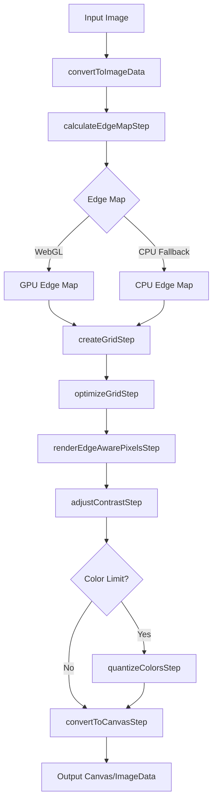
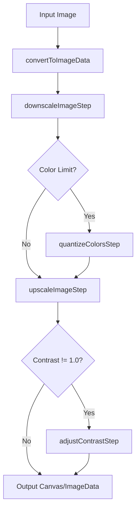
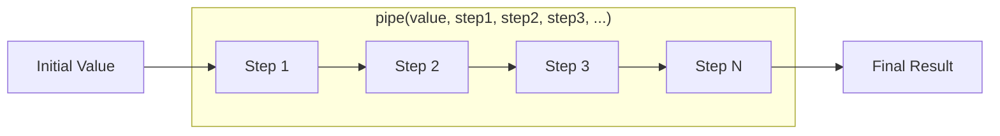

# Pixel Mosaic


A canvas-based library for pixelating images with edge-aware algorithms and projective transformations.

## Features

- Simple pixelation with nearest-neighbor scaling
- Edge-aware pixelation that aligns grid boundaries with image edges
- Configurable edge sharpness (0-1) with smooth gradient blending
- WebGL-accelerated edge detection (CPU fallback)
- Color quantization with diversity-maximizing algorithm
- Contrast adjustment
- Projective transformations (homography)

<table>
<tr>
<td><strong>Original</strong><br></td>
<td><strong>Naive Approach</strong><br></td>
</tr>
<tr>
<td><strong>Edge Detection</strong><br></td>
<td><strong>Edge Detection + Sharpening</strong><br></td>
</tr>
</table>

## Installation

```bash
npm install @yogthos/pixel-mosaic
```

## Installation

```bash
git clone https://github.com/yogthos/pixel-mosaic.git
cd pixel-mosaic
```

## Quick Start

### Using the Demo Page

1. Start a local web server (required for ES modules):

```bash
# Python 3
python3 -m http.server 8000

# Node.js (with http-server)
npx http-server -p 8000
```

### API

```javascript
import {
  pixelateImage,
  pixelateImageEdgeAware,
  loadImage,
  // Step functions for custom pipelines
  convertToImageData,
  calculateEdgeMapStep,
  createGridStep,
  optimizeGridStep,
  renderEdgeAwarePixelsStep,
  adjustContrastStep,
  quantizeColorsStep,
  // Pipeline utilities
  pipe,
  createPipeline
} from '@yogthos/pixel-mosaic';

// Load image
const img = await loadImage('image.jpg');

// Simple pixelation
const pixelated = pixelateImage(img, 5, {
  returnCanvas: true,
  colorLimit: 32,
  contrast: 1.2
});

// Edge-aware pixelation
const edgeAware = await pixelateImageEdgeAware(img, 10, {
  returnCanvas: true,
  edgeSharpness: 0.8,  // 0 = soft, 1 = crisp
  numIterations: 3
});

// Edge-aware pixelation with spline-optimized grid alignment
const splineAware = await pixelateImageEdgeAware(img, 10, {
  returnCanvas: true,
  edgeSharpness: 0.8,
  numIterations: 3,
  useSplines: true,           // Use Bezier curves during grid optimization
  splineDegree: 2,            // Quadratic Bezier curves (default: 2)
  splineSmoothness: 0.3       // Curve smoothness factor (0-1, default: 0.3)
});

// Custom pipeline using step functions
const imageData = convertToImageData(img);
const { edgeMap } = await calculateEdgeMapStep(imageData, { edgeSharpness: 0.8 });
const grid = createGridStep(imageData, 10);
optimizeGridStep({ grid, edgeMap, imageData }, { edgeSharpness: 0.8 });
const result = renderEdgeAwarePixelsStep(imageData, edgeMap, 10, 0.8);
```

## Functional Pipeline API

The library now supports a functional pipeline style where each transformation step is an independent function that can be used separately or composed into custom pipelines.

### Pipeline Utilities

```javascript
import { pipe, createPipeline } from '@yogthos/pixel-mosaic';

// pipe() applies functions sequentially
const result = pipe(
  initialValue,
  step1,
  step2,
  step3
);

// createPipeline() creates a reusable pipeline
const myPipeline = createPipeline(step1, step2, step3);
const result = myPipeline(initialValue);
```

### Step Functions

All transformation steps are available as independent functions:

#### Image Conversion Steps

- **`convertToImageData(image)`** - Converts HTMLImageElement, HTMLCanvasElement, or ImageData to ImageData
- **`convertToCanvasStep(imageData, returnCanvas)`** - Converts ImageData to Canvas or returns ImageData

#### Edge Detection Steps

- **`calculateEdgeMapStep(imageData, options)`** - Calculates edge map (WebGL or CPU fallback)
  - Returns: `Promise<{ edgeMap: Float32Array, usingGPU: boolean }>`
  - Options: `{ edgeSharpness, onProgress }`

#### Grid Steps

- **`createGridStep(imageData, pixelizationFactor)`** - Creates initial uniform grid
- **`optimizeGridStep(context, options)`** - Optimizes grid corners to align with edges
  - Context: `{ grid, edgeMap, imageData }`
  - Options: `{ searchSteps, numIterations, stepSize, edgeSharpness, useSplines, splineDegree }`

#### Rendering Steps

- **`renderEdgeAwarePixelsStep(imageData, edgeMap, pixelSize, edgeSharpness)`** - Renders edge-aware pixels
- **`downscaleImageStep(image, pixelSize)`** - Downscales image by pixel size
  - Returns: `{ scaledImageData, originalSize, scaledCanvas }`
- **`upscaleImageStep(context)`** - Upscales scaled image back to original size
  - Context: Result from `downscaleImageStep`

#### Post-Processing Steps

- **`adjustContrastStep(imageData, contrast)`** - Applies contrast adjustment (1.0 = no change)
- **`quantizeColorsStep(imageData, colorLimit)`** - Quantizes colors to reduce palette

### Example: Custom Pipeline

```javascript
import {
  convertToImageData,
  calculateEdgeMapStep,
  createGridStep,
  optimizeGridStep,
  renderEdgeAwarePixelsStep,
  adjustContrastStep,
  quantizeColorsStep,
  convertToCanvasStep
} from '@yogthos/pixel-mosaic';

// Create a custom edge-aware pixelation pipeline
async function customPixelate(image, pixelSize, options = {}) {
  const { edgeSharpness = 0.8, contrast = 1.0, colorLimit = null } = options;

  // Step 1: Convert to ImageData
  const imageData = convertToImageData(image);

  // Step 2: Calculate edge map
  const { edgeMap } = await calculateEdgeMapStep(imageData, { edgeSharpness });

  // Step 3: Create grid
  const grid = createGridStep(imageData, pixelSize);

  // Step 4: Optimize grid
  optimizeGridStep(
    { grid, edgeMap, imageData },
    { edgeSharpness, numIterations: 3 }
  );

  // Step 5: Render pixels
  let result = renderEdgeAwarePixelsStep(imageData, edgeMap, pixelSize, edgeSharpness);

  // Step 6: Apply contrast
  result = adjustContrastStep(result, contrast);

  // Step 7: Quantize colors (if requested)
  if (colorLimit) {
    result = quantizeColorsStep(result, colorLimit);
  }

  // Step 8: Convert to canvas
  return convertToCanvasStep(result, true);
}
```

### Example: Simple Pixelation Pipeline

```javascript
import {
  convertToImageData,
  downscaleImageStep,
  quantizeColorsStep,
  upscaleImageStep,
  adjustContrastStep
} from '@yogthos/pixel-mosaic';

function simplePixelate(image, pixelSize, options = {}) {
  const { colorLimit = null, contrast = 1.0 } = options;

  // Convert to ImageData
  const imageData = convertToImageData(image);

  // Downscale
  const downscaleContext = downscaleImageStep(image, pixelSize);
  let scaledData = downscaleContext.scaledImageData;

  // Apply color quantization if requested
  if (colorLimit) {
    scaledData = quantizeColorsStep(scaledData, colorLimit);
    downscaleContext.scaledCanvas.getContext('2d').putImageData(scaledData, 0, 0);
  }

  // Upscale
  const canvas = upscaleImageStep(downscaleContext);

  // Apply contrast
  if (contrast !== 1.0) {
    const ctx = canvas.getContext('2d');
    const finalData = adjustContrastStep(
      ctx.getImageData(0, 0, canvas.width, canvas.height),
      contrast
    );
    ctx.putImageData(finalData, 0, 0);
  }

  return canvas;
}
```

### Pipeline Flow Diagrams

#### Edge-Aware Pixelation Pipeline



#### Simple Pixelation Pipeline



#### Functional Pipeline Composition

The step functions can be composed using the `pipe()` utility or chained manually:



## API Reference

### `pixelateImage(image, pixelSize, options)`

Simple pixelation by scaling down and up.

**Parameters:**
- `image` - HTMLImageElement, HTMLCanvasElement, or ImageData
- `pixelSize` - Size of pixel blocks (e.g., 5 = 5x5 blocks)
- `options`:
  - `returnCanvas` (boolean) - Return canvas instead of ImageData
  - `colorLimit` (number) - Limit color palette size
  - `contrast` (number) - Contrast factor (1.0 = no change)

**Returns:** `HTMLCanvasElement|ImageData`

### `pixelateImageEdgeAware(image, pixelSize, options)`

Edge-aware pixelation with adaptive grid alignment.

**Parameters:**
- `image` - HTMLImageElement, HTMLCanvasElement, or ImageData
- `pixelSize` - Approximate size of pixel blocks
- `options`:
  - `returnCanvas` (boolean) - Return canvas instead of ImageData
  - `colorLimit` (number) - Limit color palette size
  - `contrast` (number) - Contrast factor
  - `edgeSharpness` (number, 0-1) - Edge sharpness (0 = soft, 1 = crisp)
  - `numIterations` (number) - Grid optimization iterations (default: 2)
  - `searchSteps` (number) - Search positions per corner (default: 9)
  - `useSplines` (boolean) - Use Bezier curves during grid optimization for better edge alignment (default: false)
  - `splineDegree` (number) - Bezier curve degree, 2 for quadratic or 3 for cubic (default: 2)
  - `splineSmoothness` (number) - Smoothness factor (0-1) controlling curve deviation (default: 0.3)
  - `onProgress` (function) - Progress callback `{ usingGPU: boolean }`

**Returns:** `Promise<HTMLCanvasElement|ImageData>`

### `loadImage(source)`

Loads an image from URL or File.

**Parameters:**
- `source` - URL string or File object

**Returns:** `Promise<HTMLImageElement>`

### Step Functions

All step functions are exported and can be used independently. See the [Functional Pipeline API](#functional-pipeline-api) section above for detailed documentation and examples.

**Available step functions:**
- `convertToImageData(image)`
- `calculateEdgeMapStep(imageData, options)`
- `createGridStep(imageData, pixelizationFactor)`
- `optimizeGridStep(context, options)`
- `renderEdgeAwarePixelsStep(imageData, edgeMap, pixelSize, edgeSharpness)`
- `adjustContrastStep(imageData, contrast)`
- `quantizeColorsStep(imageData, colorLimit)`
- `convertToCanvasStep(imageData, returnCanvas)`
- `downscaleImageStep(image, pixelSize)`
- `upscaleImageStep(context)`

### Pipeline Utilities

- **`pipe(initialValue, ...functions)`** - Applies functions sequentially to a value
- **`createPipeline(...functions)`** - Creates a reusable pipeline function

### `applyProjection(image, transformMatrix, options)`

Applies projective transformation using 3x3 matrix.

**Parameters:**
- `image` - HTMLImageElement, HTMLCanvasElement, or ImageData
- `transformMatrix` - 8-element array `[a1, a2, a3, b1, b2, b3, c1, c2]`
- `options`:
  - `interpolation` (string) - 'nearest' or 'bilinear'
  - `fillMode` (string) - 'constant', 'reflect', 'wrap', or 'nearest'
  - `returnCanvas` (boolean) - Return canvas instead of ImageData

**Returns:** `HTMLCanvasElement|ImageData`

**Helper functions:**
- `identityMatrix()` - Identity transformation
- `rotationMatrix(angle, centerX, centerY)` - Rotation matrix
- `scaleMatrix(scaleX, scaleY, centerX, centerY)` - Scaling matrix

## Algorithm Overview

### Simple Pixelation

1. Downscale image to `originalSize / pixelSize`
2. Optionally quantize colors
3. Upscale with nearest-neighbor interpolation

### Edge-Aware Pixelation

1. **Edge Detection**: Sobel operators with non-maximum suppression and thresholding
2. **Grid Initialization**: Regular quadrilateral grid
3. **Grid Optimization**: Moves corners to align with detected edges
4. **Color Assignment**: Blends average and median colors based on edge sharpness
5. **Rendering**: Spatial hashing for efficient pixel-to-cell mapping

Edge sharpness (0-1) controls:
- Edge detection threshold (0.1 to 0.6)
- Color blending: 0 = average (soft), 1 = median (crisp)
- Grid optimization aggressiveness

When `useSplines` is enabled:
- Grid optimization uses Bezier curves to evaluate edge alignment along curved paths
- Allows grid corners to better align with curved image edges during optimization
- Uses quadratic (degree 2) or cubic (degree 3) Bezier curves
- `splineSmoothness` controls how much curves deviate from straight lines (0 = straight, 1 = maximum curve)
- Final rendering uses uniform rectangular blocks for clean pixel art (splines only affect optimization, not output)
- More computationally expensive during optimization but produces better edge alignment

## Development

```bash
# Run tests
npm test

# Watch mode
npm run test:watch

# Coverage
npm run test:coverage
```

## Browser Support

- Modern browsers with ES6 modules
- Canvas API required
- WebGL recommended (CPU fallback available)

## Why Edge-Aware Pixelation?

Most pixelation libraries use a simple approach: downscale the image, then upscale it back. While fast, this creates pixel blocks that cut across important image features like edges, faces, and fine details, resulting in artifacts and loss of visual clarity.

**Pixel Mosaic** takes a fundamentally different approach. Instead of forcing a rigid grid onto the image, it adapts the grid to align with the image's natural structure. The result? Pixel art that preserves the essential character of the original image while achieving that distinctive low-resolution aesthetic.

### Technical Deep Dive

#### Naive Downsampling: The Traditional Approach

The naive method is straightforward:
1. **Downscale**: Reduce image dimensions by dividing by the pixel size (e.g., 1920×1080 → 384×216 for 5px blocks)
2. **Upscale**: Scale back to original size using nearest-neighbor interpolation
3. **Optional**: Apply color quantization or contrast adjustment

**Limitations:**
- Fixed grid boundaries ignore image content
- Edges get "chopped" across pixel boundaries, creating jagged artifacts
- Important features (eyes, edges, text) become distorted
- No awareness of image structure or semantics

#### Edge-Aware Algorithm: Adaptive Grid Optimization

Edge detection approach treats pixelation as an optimization problem:

1. **Edge Detection**:
   - Uses Sobel operators to compute gradient magnitude and direction
   - Applies non-maximum suppression to thin edges to single-pixel width
   - Thresholds edges using percentile-based filtering (configurable via `edgeSharpness`)
   - WebGL-accelerated for performance (CPU fallback available)

2. **Grid Initialization**:
   - Creates a regular quadrilateral grid matching the target pixel size
   - Each cell is a quadrilateral (not necessarily rectangular after optimization)

3. **Grid Optimization**:
   - Iteratively moves grid corner points to align cell boundaries with detected edges
   - Uses a search-based optimization: for each corner, tests multiple positions in a local neighborhood
   - Evaluates alignment by sampling edge strength along grid edges (straight lines or Bezier curves if `useSplines` is enabled)
   - When `useSplines` is true, uses Bezier curves to better follow curved image edges during optimization
   - Applies damping based on `edgeSharpness` to control how aggressively corners snap to edges
   - Runs for multiple iterations (default: 2-5) with progressively refined search

4. **Color Assignment**:
   - Samples pixels from uniform rectangular regions matching output blocks
   - This ensures sampling region exactly matches rendering region for clean, sharp edges
   - Blends between average color (soft) and median color (crisp) based on `edgeSharpness`
   - Note: Colors are sampled from rectangular blocks, not from deformed cell shapes, to avoid artifacts

5. **Rendering**:
   - Renders as uniform rectangular pixel blocks (classic pixel art style)
   - Each block uses the color sampled from its corresponding rectangular region
   - This approach ensures perfect alignment between sampling and rendering, eliminating fuzzy edges

**Advantages:**
- Grid boundaries align with image edges, preserving important features
- Natural-looking pixel art that maintains image semantics
- Configurable sharpness: from soft, blended edges (0.0) to crisp, high-contrast results (1.0)
- Handles complex shapes and curved edges gracefully
- WebGL acceleration makes it practical for real-time applications

### Performance Considerations

The edge-aware algorithm is more computationally intensive than naive downsampling, but optimizations make it practical:

- **WebGL acceleration**: Edge detection runs on GPU when available (10-50x faster)
- **Spatial hashing**: O(1) average-case pixel-to-cell lookup during rendering
- **Adaptive sampling**: Color calculation samples pixels at intervals for large cells
- **Iterative refinement**: Early iterations use coarser search, later iterations refine

For most images, edge-aware pixelation completes in 100-500ms on modern hardware (with WebGL), making it suitable for interactive applications.
